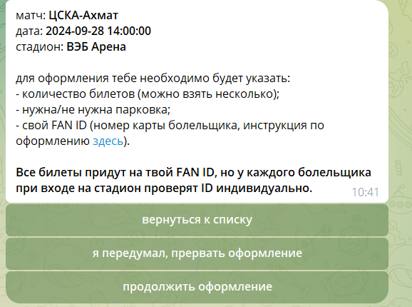

# changes list

1. Текст в начале "Привет, я ..., помогу тебе подать заявку на мероприятия. Давай знакомиться, введи корпоративную почту" меняем на "Привет, давай знакомиться. Введи свою корпоративную почту"

2. Когда сотрудник неверно ввел почту и получает ответ "Ты неверно указал почту. Я не могу принять заявку." не ясно что дальше делать. Можем вывести кнопки: начать сначала/выйти из бота?. Если выбирает "Начать сначала", то переход на "Введи свою корпоративную почту", если выбирает "Выйти из бота", то "Жду тебя снова. В случае вопросов пиши hr@winline.ru"

3. Что меняем на этом этапе: 3.1. меняем расположение кнопок: верхняя после текста - продолжить оформление, потом - я передумал, вернуть к списку (тут идем к общей таблице РПЛ/Спорт/Неспорт), я передумал, прервать оформление

Если выбирает "Я передумал, прервать оформление", то сейчас выводит "Жду тебя снова. До встреч. В случае вопросов обращайся в hr@winline.ru" меняем на "Жду тебя снова. В случае вопросов пиши hr@winline.ru"

3. на этом этапе 2 человека из маленькой выборки тестирующих восприняли так, что надо нажимать на клавиатуру и писать боту про все перечисленное. А 2 из маленькой выборки это уже многовато. Поэтому тут меняем текст

"для оформления тебе необходимо будет указать:
- количество билетов (можно взять несколько);
- нужна/не нужна парковка;
- свой FAN ID (номер карты болельщика, инструкция по оформлению здесь (https://www.gosuslugi.ru/fancard)).

Все билеты придут на твой FAN ID, но у каждого болельщика при входе на стадион проверят ID индивидуально."вот из этого всего оставляем" подумай сколько билетов тебе требуется, подготовь свой FAN ID и нажимай "продолжить оформление"

4. Когда доходим "Укажи свой FAN ID" попросили сделать проверку и вводить в формате. FAN ID это не более 9 цифры и ввод попросили в формате 111 111 111. Сможешь реализовать?

Вот этот текст везде поменять "Жду тебя снова. До встреч. В случае вопросов обращайся в hr@winline.ru" на "Жду тебя снова. В случае вопросов пиши hr@winline.ru"

попросить-то можно, но без строгой проверки один фиг будут писать кто во что горазд

4. Что касается FAN ID важна информация была мной забыта. После ввода FAN ID и на шаге проверки после номера FAN ID с новой строки пишем "
Все билеты придут на твой FAN ID, но у каждого болельщика при входе на стадион проверят ID индивидуально"

4. Еще нам надо куда то запихать ссылку на оформление FAN ID